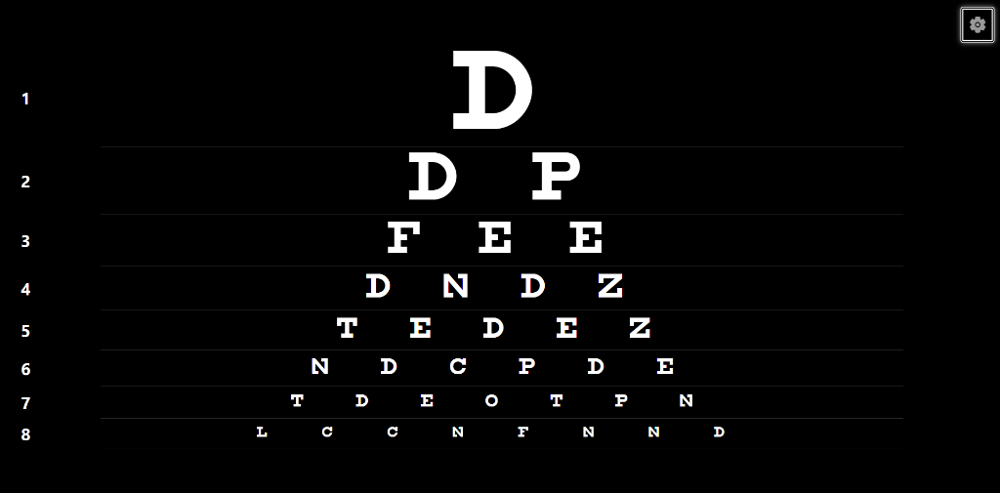
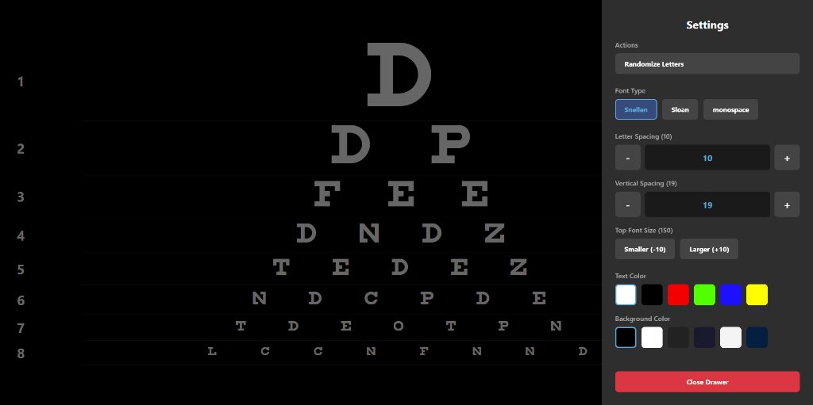

# Android TV Snellen Chart

A customizable Snellen eye chart application designed specifically for Android TV, built with React Native and Expo. 

## Features

- **TV-Optimized Navigation**: Full support for D-Pad navigation with visual focus highlights.
- **Customizable Typography**: Choose between traditional Snellen, Sloan, or monospace fonts.
- **Adjustable Sizing & Spacing**: 
  - Proportional scaling for realistic chart rendering.
  - Granular control over letter spacing and vertical spacing using TV-friendly stepper controls.
- **Dynamic Themes**: Change text and background colors to suit your environment.
- **Randomization**: Randomize the letters on the chart instantly.
- **Persistent Settings**: All customizations are saved locally and persist between sessions.

## Screenshots





## Local Development

1. Install dependencies:
   ```bash
   npm install
   ```
2. Start the local development server:
   ```bash
   npx expo start
   ```

## Building the APK

To generate a production-ready APK for your Android TV using Expo Application Services (EAS):

1. Install the EAS CLI:
   ```bash
   npm install -g eas-cli
   ```
2. Run the build command:
   ```bash
   npx eas build -p android --profile preview
   ```
